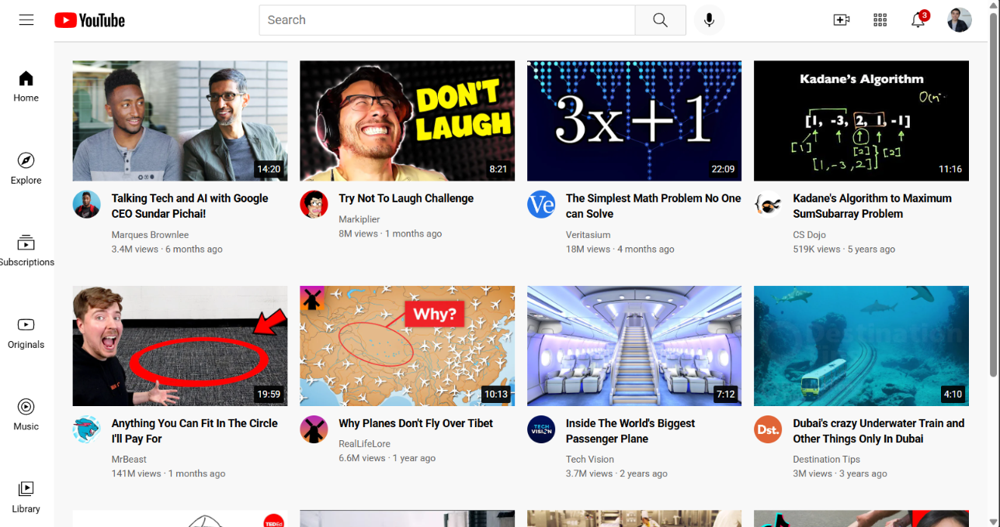

# 🎥 YouTube Homepage Clone

A responsive **YouTube Homepage Clone** built using **HTML5** and **CSS3**, replicating the layout and user interface of YouTube's home page. The project focuses on creating a pixel-perfect design while following modern web development practices.

---

## 🚀 Features

- Responsive YouTube-inspired homepage
- Navigation header with search bar
- Sidebar navigation menu
- Video thumbnail grid layout
- Channel profile hover cards
- Notification badge
- Tooltips for interactive icons
- Clean and organized CSS structure

---

## 🛠️ Technologies Used

- HTML5
- CSS3
- Google Fonts (Roboto)

---

## 📂 Project Structure

```
youtube-homepage-clone
│── index.html
│── README.md
│
├── CSS
│   ├── general.css
│   ├── header.css
│   ├── sidebar.css
│   └── video.css
│
├── images
│   ├── icons
│   ├── thumbnails
│   └── channel-picture
│
└── screenshots
    └── homepage.png
```

---

## 📸 Screenshot

> Add a screenshot of your project inside the `screenshots` folder.

```md

```

---

## ▶️ Getting Started

1. Clone the repository

```bash
git clone https://github.com/yashravat19/youtube-homepage-clone.git
```

2. Open the project folder.

3. Run `index.html` in your browser.

---

## 📚 What I Learned

- Building responsive layouts using Flexbox and CSS Grid
- Organizing CSS into modular files
- Creating reusable UI components
- Implementing hover effects and tooltips
- Structuring a real-world frontend project

---

## 🔮 Future Improvements

- Make the layout fully responsive for mobile devices
- Add Dark Mode
- Implement video search functionality using JavaScript
- Fetch video data using the YouTube API
- Add dynamic content rendering

---

## 👨‍💻 Author

**Yash Ravat**

GitHub: https://github.com/yashravat19
